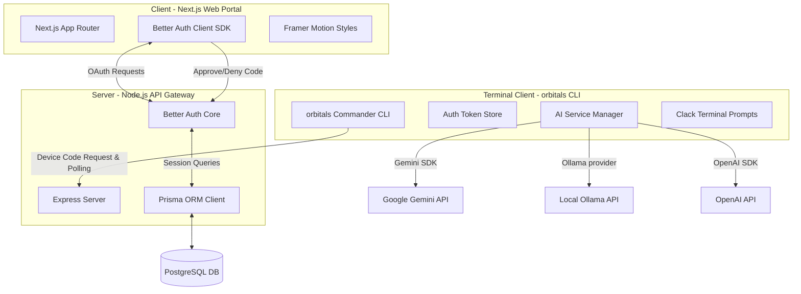
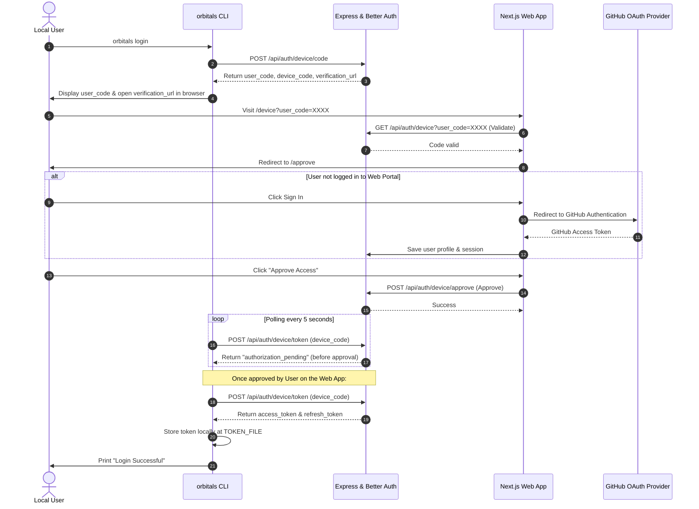

# 🏗️ Orchidd CLI (Orbital System) Architecture

This document describes the high-level system design, module structures, authentication protocols, and information flow of the **Orchidd CLI** (Orbital System) workspace.

---

## 🗺️ High-Level Component Layout

Orchidd is designed as a full-stack, distributed terminal-and-web tool. It features three main software components cooperating to provide a authenticated, AI-driven development terminal.



---

## 📦 System Modules

### 1. The Command Line Tool (`orbitals` CLI)
- **Command Router**: Built using `commander`. It defines commands like `login`, `logout`, `whoami`, and `wakeup`.
- **Credential Storage**: Stored inside a local configuration file (`~/.config/orbitals/token.json` or equivalent directory on OS).
- **Prompt Manager**: Powered by `@clack/prompts` to select options, enter inputs, and request authorization code verification.
- **Terminal Markdown Renderer**: Configured using `marked` and `marked-terminal` to support beautiful, syntax-highlighted code output, blocks, list items, and headings.

### 2. The Web Portal (`client`)
- **App Router Layout**: Built on Next.js 16 and React 19.
- **Verification Page**: Handles authorization requests. When the user visits `/device?user_code=XXXX`, the client calls `authClient.device` to confirm the validity of the code, then redirects the user to `/approve`.
- **Approve/Deny Gateway**: Displays the active session details and requires explicit user consent to bind the device session with the authenticated GitHub identity.

### 3. The API Gateway & Auth Manager (`server`)
- **Express Middleware**: Exposes endpoints to check health, route callback handlers, and serve device verification requests.
- **Better Auth Integration**: Implements the `deviceAuthorization` plugin to handle device validation codes, expirations (default: 30 minutes), and polling intervals (default: 5 seconds).
- **Prisma Client**: Links the schema models with PostgreSQL databases to query users, sessions, accounts, and message histories.

---

## 🔐 Authentication Protocol (OAuth 2.0 Device Authorization Flow)

The interaction pattern for authenticating the terminal without entering passwords directly:



---

## 🤖 The AI Engine & Chat Execution

The AI Engine manages dynamic streaming inputs/outputs and lazy-loaded tool call evaluation.

### 🔄 Data Flow in Wakeup Chat Mode

1. **Service Selection**: Reads `AI_PROVIDER` (`google`, `openai`, `ollama`) from the `.env` variables and instantiates the `AIService`.
2. **Context Assembly**: Fetches conversation history (`Conversation` and `Message` tables) using `ChatService` and formats them into standardized messages (`{ role, content }`) for the AI SDK.
3. **Structured Prompt / Tool Dispatch**:
   - **Simple Chat**: Directly streams text tokens back, rendering them into terminal markdown.
   - **Tool Calling**: Configures Gemini tools (Google Search, Code Execution, URL Context). If the model generates a `toolCall`, the server prints details (`🔧 Tool: google_search`), executes the underlying action, sends the result back to the model, and resumes streaming the final output.
   - **Agentic Mode (Zod Schema)**:
     Utilizes `generateObject` with the following validation schema:
     ```typescript
     const ApplicationSchema = z.object({
       folderName: z.string(),
       description: z.string(),
       files: z.array(z.object({
         path: z.string(),
         content: z.string()
       })),
       setupCommands: z.array(z.string())
     });
     ```
     Once generated, it outputs the project tree, creates folders recursively, writes the exact file contents, and lists the next steps (e.g., `npm install`, `npm run dev`).

---

## 🗄️ Database Schema Relationships

Built using Prisma Schema targeting PostgreSQL database:

- **`User`**: One-to-many relationship with `Session`, `Account`, and `Conversation`.
- **`Session`**: Retains user sessions with verification tokens.
- **`Account`**: Retains linked social login provider detail credentials (GitHub).
- **`DeviceCode`**: Tracks the state of outstanding authorization codes, client configurations, expirations, and user codes.
- **`Conversation` & `Message`**: Caches history files to retain context across CLI prompt restarts.
